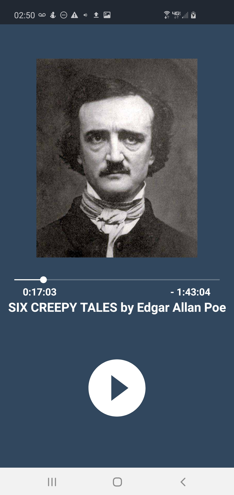

MP3Wizard is a android application that focuses on giving access to cloud stoarge/downloaded audio content. This application is designed to be used with any form of long audio content such as audiobooks.
  

  

